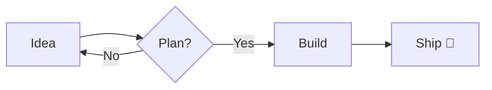
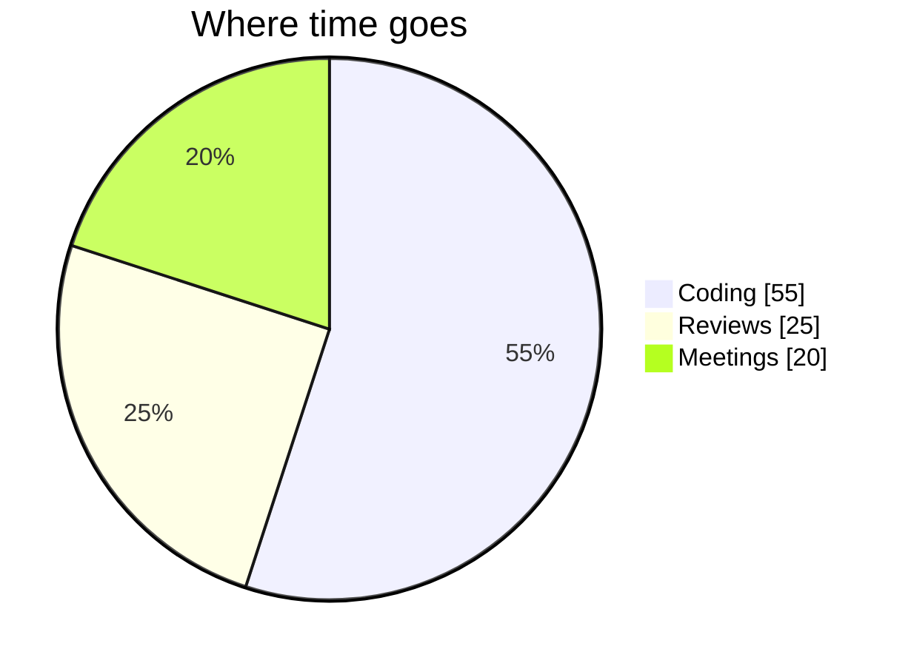

<!--
  ═══════════════════════════════════════════════════════════════════════════
  najjarlimited — Organization Profile README  (TEST / SHOWCASE)
  This file lives at profile/README.md and renders at github.com/najjarlimited
  Every section below is labeled so it doubles as a copy-paste reference sheet.
  HTML comments like this one are invisible on the rendered page.
  ═══════════════════════════════════════════════════════════════════════════
-->

<div align="center">

<!-- Section 1: Centered hero (HTML block, centered image with width control) -->


# najjarlimited

### Building things worth shipping — a showcase of everything a GitHub profile page can do

<sub>This is a <strong>test / demo</strong> profile. Every block is a feature you can reuse.</sub>

</div>

---

<!-- Section 2: Badges / shields — three style variants + dynamic GitHub badges -->
## 1 · Badges & Shields

<p align="center">
  
  
  
  
</p>

<p align="center">
  
  
  
</p>

<!-- Dynamic badges pull live numbers from GitHub. Uncomment once repos exist. -->
<!--
  
  
-->

> Static badges use `img.shields.io/badge/LABEL-MESSAGE-COLOR`. Swap `style=` for a different look.

---

<!-- Section 3: Text styling primitives -->
## 2 · Text Styling

**Bold**, *italic*, ***bold italic***, ~~strikethrough~~, `inline code`, and [a link](https://github.com/najjarlimited).

Subscript: H<sub>2</sub>O · Superscript: E = mc<sup>2</sup>

Keyboard keys: press <kbd>Ctrl</kbd> + <kbd>C</kbd> to copy, <kbd>⌘</kbd> + <kbd>V</kbd> to paste.

> A simple blockquote.
>> A nested blockquote inside it.

---

<!-- Section 4: GitHub-native alerts / callouts -->
## 3 · Alerts / Callouts

> [!NOTE]
> Highlights information users should notice, even when skimming.

> [!TIP]
> Optional advice to help users do things better.

> [!IMPORTANT]
> Key information users need to succeed.

> [!WARNING]
> Urgent info that needs immediate attention.

> [!CAUTION]
> Advises about risks or negative outcomes of an action.

---

<!-- Section 5: Lists — ordered, unordered nested, task list -->
## 4 · Lists

**Ordered**
1. First
2. Second
3. Third

**Unordered + nested**
- Frontend
  - React
  - Tailwind
- Backend
  - Node
  - Postgres

**Task list**
- [x] Create the `.github` repo
- [x] Add a profile README
- [ ] Merge to default branch to go live
- [ ] Add community health files

---

<!-- Section 6: Tables with per-column alignment -->
## 5 · Tables

| Feature            | Renders on GitHub | Notes                          |
| :----------------- | :---------------: | -----------------------------: |
| Alerts             |        ✅         |          `> [!NOTE]` syntax    |
| Mermaid diagrams   |        ✅         |         fenced ` ```mermaid `  |
| Collapsible blocks |        ✅         |     `<details><summary>`       |
| HTML two-column    |        ✅         |          via `<table>`         |

<sub>Colons in the divider row control alignment: `:---` left, `:--:` center, `---:` right.</sub>

---

<!-- Section 7: Code blocks with syntax highlighting + a diff block -->
## 6 · Code Blocks

```js
// JavaScript
export const greet = (name) => `Hello, ${name}!`;
```

```python
# Python
def greet(name: str) -> str:
    return f"Hello, {name}!"
```

```bash
# Bash
git push -u origin main
```

```diff
- const old = "before";
+ const shiny = "after";
```

---

<!-- Section 8: Collapsible accordions -->
## 7 · Collapsible Sections

<details>
  <summary><strong>▶ Click to expand — FAQ</strong></summary>

  <br/>

  **Q: How do I make this the live org page?**
  Merge this branch into the default branch. GitHub serves `profile/README.md` automatically.

  **Q: Can I nest anything inside?**
  Yes — lists, tables, code, even images all work inside `<details>`.

</details>

<details>
  <summary><strong>▶ Click to expand — Tech stack</strong></summary>

  <br/>

  - Languages: TypeScript, Python
  - Infra: Docker, GitHub Actions

</details>

---

<!-- Section 9: Mermaid diagrams (GitHub renders these natively) -->
## 8 · Mermaid Diagrams





---

<!-- Section 10 & 11: Image grid + two-column layout via HTML tables -->
## 9 · Image Grid & Two-Column Layout

<table>
  <tr>
    <td align="center" width="33%">
      <br/>
      <sub>Craft first</sub>
    </td>
    <td align="center" width="33%">
      <br/>
      <sub>Ship fast</sub>
    </td>
    <td align="center" width="33%">
      <br/>
      <sub>Improve always</sub>
    </td>
  </tr>
</table>

<table>
  <tr>
    <td valign="top" width="50%">

**Left column**

- HTML `<table>` gives you real columns
- Markdown works *inside* each cell
- Great for "About" + "Contact"

    </td>
    <td valign="top" width="50%">

**Right column**

- Keep cells to ~50% width
- Blank line after `<td>` lets markdown render
- Responsive-ish on most viewports

    </td>
  </tr>
</table>

---

<!-- Section 12: Footnotes -->
## 10 · Footnotes

GitHub supports reference-style footnotes.[^1] You can have more than one.[^long]

[^1]: This is the first footnote — it renders at the bottom of the page.
[^long]: Footnotes can contain multiple sentences and `inline code` too.

---

<!-- Section 13: Emoji + horizontal rules + progress bars -->
## 11 · Emoji, Rules & Progress

Emoji shortcodes: :rocket: :sparkles: :white_check_mark: :bug: :tada: :fire:

Progress (via shields):


***

<!-- Section 14: Optional third-party stat cards (noted as external) -->
## 12 · Optional: GitHub Stat Cards

> [!TIP]
> These are rendered by the third-party service **github-readme-stats** (not GitHub itself).
> They only show meaningful data once the org has public repos. Uncomment to use.

<!--


-->

---

<div align="center">

<sub>Built as a feature showcase · <code>profile/README.md</code> · najjarlimited</sub>

<sub>Merge this branch into the default branch to publish it as the live org profile.</sub>

</div>
